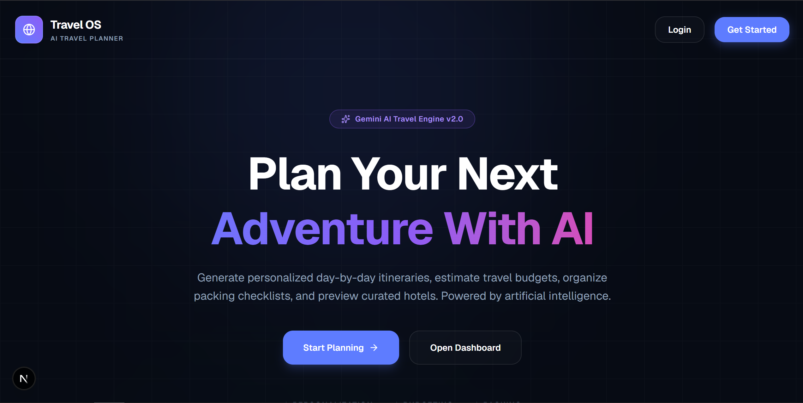
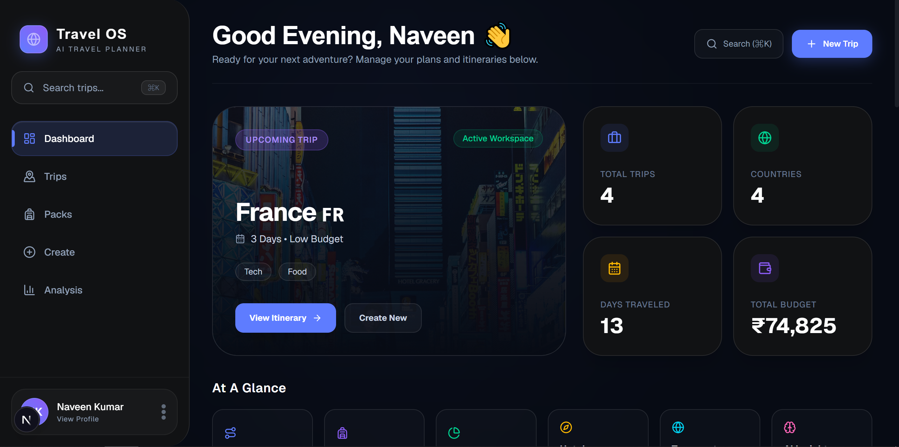
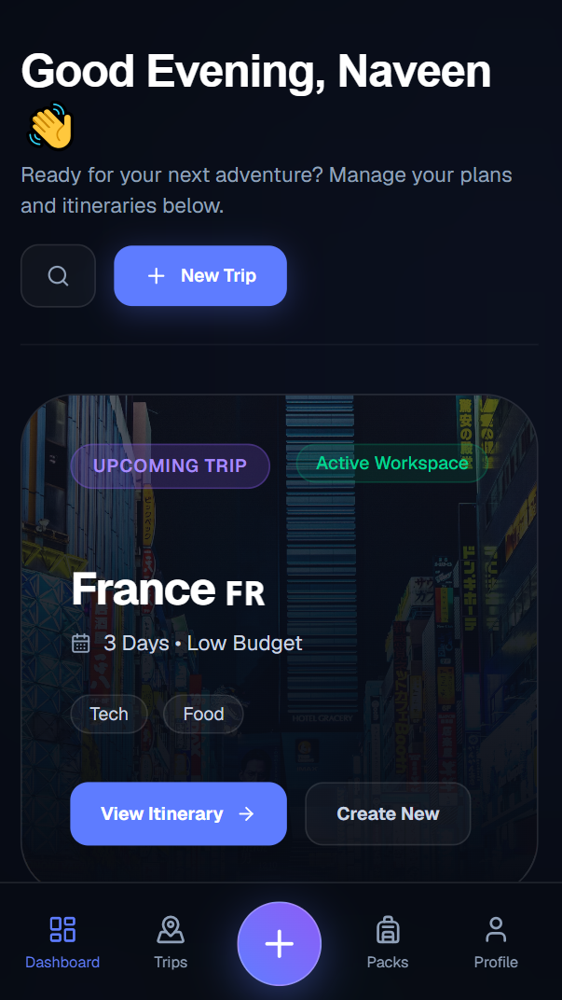

# ✈️ AI Travel Planner

An AI-powered travel planning application that generates personalized travel itineraries, packing lists, hotel recommendations, and budget estimates using Google's Gemini AI.

---

## 📸 Screenshots

### Homepage



---

### Dashboard



---



---

# 🚀 Features

## Authentication

* User Registration
* Secure Password Hashing with bcrypt
* JWT Authentication
* Login & Logout
* Protected Routes
* Persistent Authentication

---

## AI Trip Generation

Generate complete travel plans using Gemini AI.

### Inputs

* Destination
* Duration
* Budget Tier
* Interests

### AI Generates

* Day-by-Day Itinerary
* Estimated Budget
* Hotel Recommendations
* Packing List

---

## Dashboard

* View all trips
* Search trips
* Trip statistics
* Select and manage trips
* Responsive UI

---

## Itinerary Management

### Day Regeneration

Regenerate a specific itinerary day without affecting other days.

Example:

* Day 1 ✅ Keep
* Day 2 ✅ Keep
* Day 3 🔄 Regenerate
* Day 4 ✅ Keep
* Day 5 ✅ Keep

---

### Add Activity

Add custom activities to the last day.

Each activity includes:

* Title
* Description
* Estimated Cost

Example:

* Farewell Dinner
* ₹2500
* Detailed description

---

### Activity Cost Tracking

Every itinerary activity displays:

* Activity Name
* Description
* Estimated Cost

---

## Packing List

Organized into categories:

### Crucial Documents

* Passport
* Tickets
* Travel Insurance

### Activity Equipment

* Hiking Shoes
* Camera
* Power Bank

### Climate Wear

* Jacket
* Umbrella
* Seasonal Clothing

Supports checklist updates.

---

## Budget Breakdown

Displays:

* Accommodation
* Food
* Activities
* Transport
* Total Cost

---

## Ownership Validation

Users can only:

* View their own trips
* Edit their own trips
* Regenerate their own itinerary days
* Update their own packing lists

---

## AI Validation Layer

All AI responses are validated before saving.

Validation includes:

* Destination
* Duration
* Budget Tier
* Interests
* Hotels
* Itinerary Structure
* Activity Costs
* Packing List Structure

---

# 🏗️ Tech Stack

## Frontend

* Next.js 15
* React 19
* TypeScript
* Tailwind CSS
* Axios
* React Hot Toast

---

## Backend

* Node.js
* Express.js
* MongoDB
* Mongoose
* JWT Authentication
* bcrypt

---

## AI

* Google Gemini API
* Structured JSON Generation
* AI Response Validation

---

# 📁 Project Structure

```bash
ai-travel-planner
│
├── frontend
│   ├── src
│   │   ├── app
│   │   ├── components
│   │   ├── services
│   │   ├── types
│   │   └── utils
│   │
│   └── public
│
├── backend
│   ├── controllers
│   ├── middleware
│   ├── models
│   ├── routes
│   ├── services
│   ├── config
│   └── server.js
│
└── README.md
```

---

# ⚙️ Environment Variables

## Backend (.env)

```env
PORT=5000

MONGO_URI=your_mongodb_connection_string

JWT_SECRET=your_jwt_secret

GEMINI_API_KEY=your_gemini_api_key
```

---

# 📦 Installation

## Clone Repository

```bash
git clone https://github.com/NaveenTechist/ai-travel-planner.git
```

```bash
cd ai-travel-planner
```

---

# Backend Setup

```bash
cd backend
```

Install dependencies:

```bash
npm install
```

Run development server:

```bash
npm run dev
```

Build:

```bash
npm run build
```

---

# Frontend Setup

```bash
cd frontend
```

Install dependencies:

```bash
npm install
```

Run development server:

```bash
npm run dev
```

Build:

```bash
npm run build
```

---

# API Flow

## Create Trip

```text
User Input
    ↓
Validation
    ↓
Gemini AI
    ↓
AI Validation
    ↓
MongoDB Save
    ↓
Dashboard Update
```

---

## Regenerate Day

```text
Select Day
    ↓
Generate New Day
    ↓
Validate Response
    ↓
Replace Selected Day
    ↓
Save Changes
```

---

## Add Activity

```text
Open Modal
    ↓
Enter Details
    ↓
Save Activity
    ↓
Update Trip
    ↓
Refresh UI
```

---

# Security

* JWT Authentication
* Password Hashing (bcrypt)
* Protected Routes
* Ownership Validation
* Request Validation
* AI Response Validation

---

# Future Enhancements

* Activity Editing
* Activity Deletion
* Day Deletion
* Day Creation
* Weather Integration
* Maps Integration
* Flight Recommendations
* Real-time Currency Conversion
* Offline Mode
* AI Chat Assistant
* PDF Trip Export
* Shareable Trips

---

# Contributing

Pull requests and suggestions are welcome.

---

# Author

**Naveen**

GitHub:
https://github.com/NaveenTechist

---

# Disclaimer

This project uses Generative AI (Google Gemini). AI-generated recommendations may occasionally contain inaccuracies. Users should verify important travel information before making bookings or travel decisions.

---

Try:
User Name: firstuser@gmail.com
Password: 123456

Please don't use AI overuse becuase we don't have that much credits.

